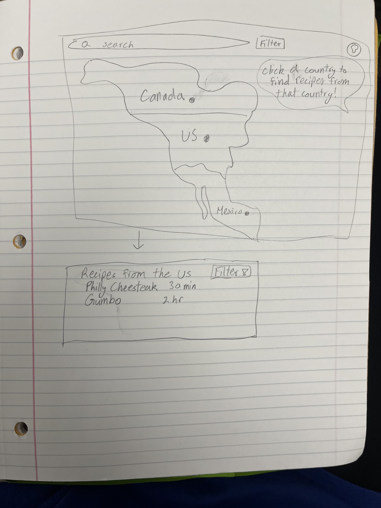

# Recipes Worldwide
A recipe sharing platform. Users can create accounts, submit recipes, view and rate recipes, and search for recipes based on certain tags (such as country, ingredients, or type). There will also be a world map page, in which users can click countries to see famous food from that country.

## Pages:
- Login page
- Homepage with world map
- Search bar and filtering
- Ai natural language search questions
- User profile page
- Pages for each recipe
- Add/Edit recipe page

## ERD

## Tech Stack
### Frontend
- Vue
- TypeScript
- TailwindCSS
### Backend
- Node.js
- Express.js
- Supabase (Data persistence)
- Cognito (Authentication)
- EC2 (Deployment)

## Project Milestones
- 11/7 finish database schema/ design and split up work
- 11/11 Set up Cognito and Supabase and sudo front end to test on
- 11/14 base components made that we will share across pages
- 11/18 Work on pages
- 11/21 complete Login, Recipe, Profile page, and associated server endpoints
- 11/25 complete world map homepage and add/edit recipe page
- 11/28 add recipes to database and test functionality
- 12/2Fix bugs and implement smaller features like liking and rating, filtering, etc
- 12/5 make slides and presentation
- 12/8 Present

## Local setup
### server
Setup steps
- in `server`:
	- run `npm install`
	- create `.env` file with SUPABASE_URL, SUPABASE_KEY, AWS_ACCESS_KEY_ID, AWS_SECRET_ACCESS_KEY, AWS_REGION, and S3_BUCKET_NAME
	- any time the supabase schema changes you need to run `npm run db:getTypes` to update the local typescript types
	- use `npm run dev` to start dev server
- in `client`:
	- run `npm install`
	- use `npm run dev` to start dev server
- in `shared`:
	- run `npm run build`
	- Anytime any code in `shared` is updated, you must run `npm run build` for those changes to be accessible from `client` and `server`

## By 11/18
## Kyler = add login capability and continue as guest
## Preston = expressjs code --> backend
## Grayden = S3 --> 1 bucket with folders
## Lily = welcome page = home --> recipe of the day --> search page --> natural language ai, filtering
 