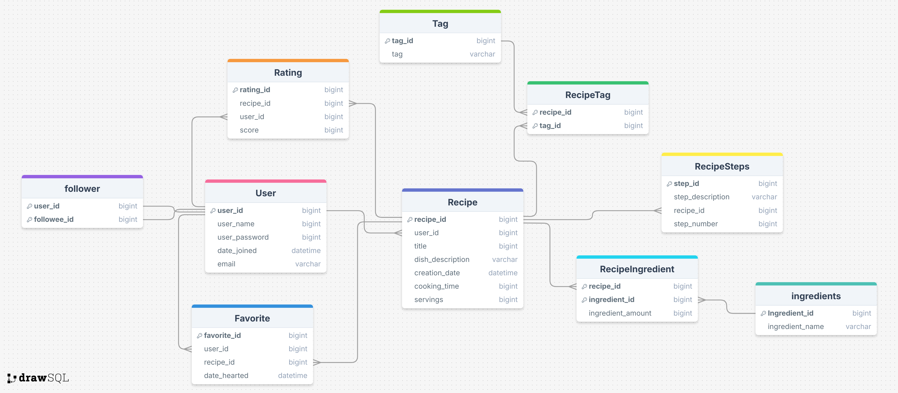
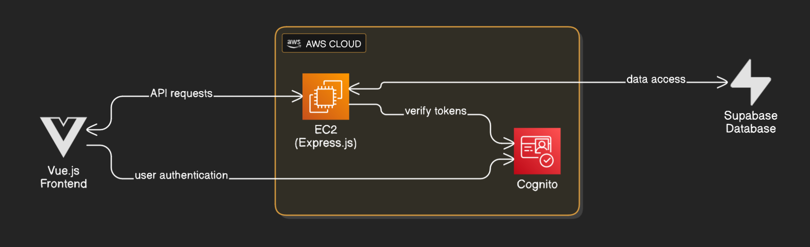

# Final Report
Contributors: Lillian Hill, Grayden Hays, Preston Ford, and Kyler Moulton

## Summary
Recipes Worldwide is a recipe sharing platform that emphasizes discovering the cuisine of other cultures. After creating an account, the website allows users to create and edit their own recipes, view and rate others' recipes, and explore an interactive map of the world to see popular dishes from each country.

## Diagrams
### ERD

### Technology Interaction Diagram

## Demo Video
[Watch the video](worldwiderecipesDemoVideo.mp4)
## Learnings
- Trouble with mixed tech stack
	- Could not use RLS; Supabase RLS is designed to work with Supabase Auth, not Cognito
	- Supabase Javascript client is limited (can't do complex joins)
	- Make sure to research the full capabilities of a technology rather than cherry pick most common uses of different technologies
- Important to configure CORS policy correctly
	- AWS has built in safeguards
	- Difficult to debug when there are conflicts
- Importance of Communication
	- Code organization
	- Consistent naming patterns
	- Code duplication/conflicts when our contributions are not communicated 

## AI Integration
Planned but not implemented

## AI Assistance in Development
We used AI to familiarize ourselves with the different technologies in our stack and explore our design options. For example, I (Preston) asked AI how we might structure our monorepo such that the client and server modules can share TypeScript types, in order to remove duplication. I also used AI to research options for libraries, such as D3, the JavaScript data visualization library that powers the map page. Lily did similar things like using AI to suggest different ways to structure code and also to help explain error messages.

## Why This Project Interests Us
Food is a universal language that brings people together, and all of us are passionate about exploring different cuisines from around the world. We wanted to create a platform that makes discovering authentic recipes from specific countries and regions both intuitive and exciting. 

Traditional recipe websites often rely on keyword searches or endless scrolling, which can feel limiting when you're craving something specific but don't know exactly what to search for. Our solution addresses this through two innovative features: an interactive global map that lets users visually explore recipes by geographic location, and AI-powered natural language search that understands queries like "show me spicy Korean dishes" or "what's a traditional Italian pasta from the south?" 

By combining geographic visualization with intelligent search, we're making it easier than ever to discover new dishes, explore culinary traditions, and connect with food cultures from every corner of the globe.

## Failover strategy, scaling characteristics, performance characteristics, authentication, concurrency, etc
- Performance Characteristics
	- Recipes are paginated, so no one query will be too expensive
	- The primary and foreign keys are indexed, so when a query is made, the whole table doesn’t have to be searched
- Authentication
	- Authentication via Cognito. Users sign up with their email and receive a verification code via email. Recipes can only be created by authenticated users, and recipes can only be edited by their creator.
- Future Thoughts
	- In the future we can employ caching to speed up certain requests. For example, Rating is determined by joins on the Recipe and Rating table. Ratings don't always need to be up to date, so we might consider caching ratings.
